<div align="center">

# BigOcrPDF

**The complete OCR toolkit for Linux — turn scanned PDFs and images into searchable, editable documents.**

[](LICENSE)
[](https://python.org)
[](https://gnome.org)

</div>

---

BigOcrPDF is a powerful, all-in-one OCR application that adds searchable text layers to scanned PDFs, extracts text from images, and provides a full-featured PDF editor — all from a modern, native Linux interface.

## Three Interfaces, One Toolkit

BigOcrPDF offers three independent interfaces that cover every stage of document work:

### 1. PDF OCR (`bigocrpdf`)

The main interface. Drop your scanned PDFs, choose your settings, and get searchable documents back. Ideal for:

- Turning scanned paperwork, contracts, and books into searchable PDFs
- Archiving documents as PDF/A-2b for long-term preservation
- Batch-processing dozens of files with checkpoint/resume
- Re-OCR'ing documents that already have a poor text layer
- Exporting extracted text as TXT or ODF/ODT with layout detection

### 2. PDF Editor (`bigocrpdf --edit` or `bigocrpdf -e`)

A standalone page editor that runs independently of the OCR window. Use it to organize your PDFs before or after OCR:

- Reorder, rotate, flip, and delete pages with drag-and-drop
- Merge multiple PDFs and images into a single document
- Import photos (JPEG, PNG, TIFF, WebP, RAW) with automatic EXIF rotation
- Split large PDFs by page count or target file size
- Compress PDFs with configurable quality and DPI
- Save individual pages as images or separate PDFs

### 3. Image OCR (`bigocrimage`)

A lightweight window for quick text extraction from images and screenshots:

- Open any image — JPEG, PNG, WebP, TIFF, or RAW (CR2, DNG, NEF, ARW…)
- Capture a screen region and extract the text instantly
- Copy results to clipboard with one click
- Works with Spectacle (KDE), GNOME Screenshot, and Flameshot

---

## Key Features

### OCR Engine

State-of-the-art text recognition powered by deep learning.

- **RapidOCR PP-OCRv5** models with OpenVINO inference (ONNX fallback)
- **130+ languages** across 12 script families: Latin, Chinese, Japanese, Korean, Arabic, Cyrillic, Greek, Devanagari, Tamil, Telugu, Thai, and more
- **4 precision levels** — tune the trade-off between capturing hard-to-read text (tolerates more false positives) and strict recognition (avoids false positives but may miss low-legibility text)
- **Parallel processing** — multi-core batch OCR with automatic worker scaling
- **Invisible text layer** — preserves original page appearance while adding searchable text
- **Smart detection** — auto-identifies image-only vs. mixed-content PDFs
- **Re-OCR support** — replace existing text layers with improved recognition
- **Right-to-left text** — full BiDi support for Arabic and Hebrew via `fribidi`

### Image Preprocessing

Automatically clean up scans and photos before OCR for maximum accuracy.

- **Perspective correction** — 6-mode cascade that straightens photographed documents
- **Auto deskew** — fixes tilted scans using morphological analysis + Hough transform
- **Baseline dewarp** — per-line polynomial fitting to flatten curved text
- **Orientation detection** — auto-correct 90°/180°/270° rotations
- **Illumination normalization** — even out uneven lighting
- **Scanner effect** — LAB-space background normalization
- **Denoising** — bilateral filter and Non-Local Means
- **Enhance embedded images** — apply corrections to images inside mixed-content pages
- **All toggles individually controllable** from educational settings dialogs with visual illustrations

### Export Options

Get your text out in the format you need.

| Format | Description |
|--------|-------------|
| **Searchable PDF** | Original pages with invisible OCR text layer |
| **PDF/A-2b** | ISO archival standard with metadata injection (preserves original images) |
| **Custom Quality PDF** | Choose JPEG quality: 30%, 50%, 70%, 85%, or 95% |
| **Black & White (JBIG2)** | Pure black-and-white output using JBIG2 — the most compact format for text-only documents |
| **Plain Text (.txt)** | Extracted text from all pages |
| **ODF/ODT** | Formatted text with optional embedded images *(experimental — formatting quality may vary)* |

ODF export includes **layout analysis**: automatic paragraph/heading detection, table detection, image embedding, and proper page breaks. Note: ODF/ODT export is experimental and formatting results may not always be accurate.

### Batch Processing & Session Management

Handle large workloads efficiently.

- **Multi-file queue** — add files via drag-and-drop or file chooser, with grid and list views
- **File information** — right-click any file to view PDF metadata, fonts, images, and attachments
- **Checkpoint/resume** — interrupted sessions automatically resume on next launch
- **Processing history** — tracks file sizes, page counts, processing time, and success/failure
- **Cancel anytime** with clean cleanup
- **Auto-split output** — configurable maximum file size (10MB–100MB)
- **Results page** with per-file statistics, text viewer, and export actions

---

## Installation

### From Source

```bash
git clone https://github.com/biglinux/bigocrpdf.git
cd bigocrpdf
pip install -e .
```

#### Dependencies

| Package | Purpose |
|---------|---------|
| `python >= 3.10` | Runtime |
| `gtk4`, `libadwaita` | User interface |
| `python-rapidocr-pp-ocrv5` | OCR engine |
| `python-rapidocr-openvino` | Hardware-accelerated inference |
| `poppler-utils` | PDF image extraction (`pdfimages`, `pdfinfo`) |
| `ghostscript` | PDF/A-2b conversion |
| `python-opencv` | Image preprocessing |
| `python-numpy` | Array operations |
| `python-pillow` | Image format support |
| `python-odfpy` | ODF/ODT export |
| `fribidi` | BiDi text reordering (Arabic, Hebrew) |

---

## Usage

### GUI

```bash
bigocrpdf                     # PDF OCR — main interface
bigocrpdf --edit file.pdf     # PDF Editor — standalone page editor
bigocrpdf -e file.pdf         # (short form)
bigocrimage                   # Image OCR — quick text extraction
```

### Command Line

```
bigocrpdf [OPTIONS] [FILES...]

Options:
  -e, --edit        Open the PDF editor instead of the OCR interface
  -v, --version     Show version and exit
  -d, --debug       Enable debug logging
  --verbose         Verbose output
  --image-mode      Launch in image OCR mode
  FILES             PDF or image files to open
```

### File Manager Integration

- **Right-click a PDF** → *Recognize text in scanned PDF (OCR)*
- **Right-click an image** → *Extract text from image (OCR)*
- **KDE Dolphin** context menu integration included

### Screen Capture

Press **Print Screen** → select a region → export to **Extract text from image (OCR)**.

---

## Interface

### UI Highlights

- **GTK4 + Libadwaita** — clean, modern design following GNOME Human Interface Guidelines
- **Multi-page wizard** — Settings → Processing → Results
- **Educational dialogs** — image corrections, output, and advanced settings with SVG illustrations explaining each option
- **Grid / List view toggle** — switch between compact grid and detailed list in the file queue
- **Context menus** — right-click files in the queue or pages in the editor for quick actions
- **Toast notifications** — non-intrusive status feedback
- **Before/After comparison** — track file size changes after OCR
- **Window size persistence** — remembers your preferred dimensions for all windows
- **Keyboard shortcuts** — comprehensive shortcuts for all major actions
- **28 UI languages** — Bulgarian, Chinese, Czech, Croatian, Danish, Dutch, English, Estonian, Finnish, French, German, Greek, Hebrew, Hungarian, Icelandic, Italian, Japanese, Korean, Norwegian, Polish, Portuguese, Romanian, Russian, Slovak, Spanish, Swedish, Turkish, Ukrainian

---

## Architecture

```mermaid
graph TD
    A[bigocrpdf] --> B[Application Layer]
    A --> C[Services Layer]
    A --> D[UI Layer]
    A --> E[Utils Layer]

    B --> B1[application.py<br/>Adw.Application entry point]
    B --> B2[window.py<br/>Main PDF OCR window]
    B --> B3[config.py<br/>Constants & configuration]

    C --> C1[processor.py<br/>OCR engine interface]
    C --> C2[screen_capture.py<br/>Screen capture & image OCR]
    C --> C3[export_service.py<br/>PDF / Text / ODF export]
    C --> C4[contour_analysis.py<br/>Document contour detection]
    C --> C5[perspective_correction.py<br/>Geometric correction]
    C --> C6[rapidocr_service/]

    C6 --> C6a[engine.py — Singleton OCR engine]
    C6 --> C6b[ocr_worker.py — Subprocess worker]
    C6 --> C6c[preprocessor.py — Image pipeline]
    C6 --> C6d[rotation.py — Orientation detection]

    D --> D1[image_ocr_window.py<br/>Standalone image OCR]
    D --> D2[settings_page.py<br/>OCR settings]
    D --> D3[conclusion_page.py<br/>Results & export]
    D --> D4[pdf_editor/<br/>PDF page editor]

    E --> E1[odf_exporter.py<br/>ODF document generation]
    E --> E2[layout_analyzer.py<br/>Document structure detection]
    E --> E3[checkpoint_manager.py<br/>Session resume support]

    style A fill:#4A86CF,color:#fff
    style C6 fill:#3776AB,color:#fff
```



---

## Quality & Testing

- **303 automated tests** covering OCR pipeline, PDF operations, export, preprocessing, editor logic, and utilities
- **100% i18n coverage** — all 28 languages fully translated (604 strings each)
- **Ruff-enforced** code style and linting
- **WCAG 2.1 Level AA** accessibility considerations

---

## License

[GPL-3.0-or-later](LICENSE)
