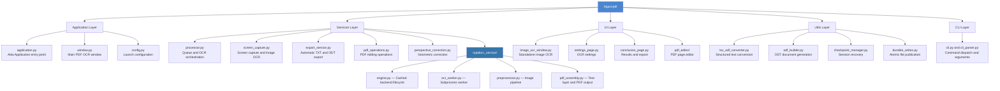

<div align="center">

# BigOcrPDF

**OCR for scanned PDFs and images, with PDF page editing and native Linux interfaces.**

[](LICENSE)
[](pyproject.toml)
[](pyproject.toml)
[](https://gnome.org)

</div>

---

BigOcrPDF is a GTK4/libadwaita application for adding searchable text layers to scanned
PDFs, extracting text from images, and editing PDF pages. The project also provides a
dedicated image OCR application and a separate command-line PDF toolbox.

## Main capabilities

- **Searchable PDF output** using RapidOCR, with PP-OCRv6 selected by default
- **Mixed-content handling** that distinguishes image-only pages from pages with native text
- **PDF page editing** for reordering, rotating, flipping, deleting, merging, splitting, and
  compressing pages
- **Image preprocessing** for perspective, skew, curvature, orientation, contrast, brightness,
  noise, and border corrections
- **Structured exports** to plain text, Markdown, and ODT
- **Batch processing** with a persistent checkpoint and an option to resume an interrupted run
- **Image and screen-capture OCR** in the standalone `bigocrimage` interface
- **File-manager actions** for KDE Dolphin, GNOME Files (Nautilus), and Nemo when the
  corresponding integration files are installed

---

## Features

### PDF editor

- Drag-and-drop page reordering with thumbnail previews
- Left/right rotation and horizontal/vertical flipping
- Page deletion and multi-page selection
- Merging PDFs and supported raster images into one PDF
- JPEG, PNG, WebP, TIFF, and BMP image import; the main queue also accepts AVIF
- EXIF orientation handling when images are converted to PDF
- Thumbnail zoom presets from 50% through 400%
- Per-page inclusion or exclusion from OCR
- Context actions to save a page as an image or a PDF
- Compression with configurable image quality and target DPI
- Splitting by page count or target file size
- Undo for page operations with <kbd>Ctrl</kbd>+<kbd>Z</kbd>

### OCR pipeline

- RapidOCR PP-OCRv6 exclusively, using one unified model for supported languages
- OpenVINO as the default CPU inference engine and ONNX Runtime as an alternative
- Automatic worker selection for parallel OCR
- Four detection-threshold presets in the graphical settings
- Invisible Unicode text layers for searchable and selectable output
- Automatic handling of image-only and mixed-content PDF pages
- Optional replacement of an existing OCR text layer
- Optional geometric corrections and image enhancements
- Resource limits for page count, image dimensions, and rendered page size

PP-OCRv6 recognizes Chinese, English, Japanese, and 46 Latin-script languages with one
unified model, so the graphical applications do not ask users to choose a language. The
application requires the PP-OCRv6 detection and recognition files at startup and does not
fall back to PP-OCRv5 language-specific models.

### Image preprocessing

- Perspective correction for photographed documents
- Deskew and baseline dewarping
- 90°/180°/270° orientation detection
- Contrast and brightness correction
- Denoising and dark-border cleanup
- Background normalization through the scanner-effect option
- Optional correction of embedded images on mixed-content pages

Geometric corrections are enabled by default. Most color enhancements remain opt-in so the
user can choose between preserving the source appearance and applying stronger cleanup.

### Output and export

| Format | Behavior |
|--------|----------|
| **Searchable PDF** | Adds an invisible text layer; pages that require geometric or appearance changes may be rendered into the output |
| **PDF/A-2b option** | Adds PDF/A metadata and an sRGB output intent when a supported ICC profile is available; otherwise processing falls back to a normal PDF |
| **Image quality presets** | Preserve original images or select lossy quality presets from 30% through 95% |
| **Black-and-white output** | Uses JBIG2 when `jbig2enc` is installed and CCITT Group 4 as the fallback; forcing this mode removes color |
| **Plain text (`.txt`)** | Exports structured text when positional PDF text data is available |
| **Markdown (`.md`)** | Exports detected document structure, optionally with YAML front matter |
| **ODT (`.odt`)** | Choose editable text positioned by PDF coordinates or a reflowable structured export of detected paragraphs, headings, tables, columns, and page breaks |

ODT layout is inferred from OCR/PDF coordinates and remains experimental. Review the result
when the source contains complex layouts, unusual fonts, or ambiguous tables.

### Image and screen-capture OCR

- Open an image, drop one onto the window, or paste image data with
  <kbd>Ctrl</kbd>+<kbd>V</kbd>
- Capture a region through the **Screen Capture** action
- Use the XDG Desktop Portal when available, with Spectacle, GNOME Screenshot, and Flameshot
  as command-line fallbacks
- Edit the recognized text and copy it to the clipboard
- Run `bigocrimage` as a separate image OCR application

JPEG, PNG, WebP, TIFF, and BMP are the common supported inputs. The standalone interface
recognizes additional filename extensions, including GIF and AVIF, but successful decoding
of those formats depends on the image loaders available on the system.

### Batch processing and recovery

- Multi-file queue with grid and list presentations
- PDF metadata, font, image, and attachment information in the queue
- Persistent per-run checkpoints; the application offers to resume pending files after an
  interrupted session
- Processing history with file, page, duration, and outcome data
- Cooperative cancellation and temporary-output cleanup
- Optional maximum output size that publishes numbered PDF parts when the result is too large
- A results page with per-file outcomes, extracted text, and export actions

---

## Installation

### System requirements

Package names vary by distribution. Before installing the Python project, provide:

- Python 3.12 or newer
- GTK 4.22 or newer, libadwaita 1.8 or newer, PyGObject, Pycairo, and their GObject Introspection data
- Poppler command-line tools, including `pdfinfo`, `pdfimages`, `pdftotext`, `pdftoppm`,
  `pdffonts`, and `pdfdetach`
- RapidOCR and the OCR models/fonts required for the languages you intend to use
- The Python dependencies declared in [`pyproject.toml`](pyproject.toml)

Optional runtime components:

- `jbig2enc` for JBIG2 compression (CCITT Group 4 is used when it is absent)
- An sRGB ICC profile from colord or Ghostscript for the PDF/A-2b option
- XDG Desktop Portal, Spectacle, GNOME Screenshot, or Flameshot for region capture

### Editable source installation

```bash
git clone https://github.com/biglinux/bigocrpdf.git
cd bigocrpdf
python -m venv .venv
source .venv/bin/activate
python -m pip install --upgrade pip
python -m pip install -e .
```

The editable Python installation creates the three entry points documented below. Desktop
files, icons, compiled translations, file-manager actions, and distribution-specific model
packages are outside the Python wheel and must be installed by the system packaging layer;
see [`pkgbuild/PKGBUILD`](pkgbuild/PKGBUILD) and [`default.nix`](default.nix).

---

## Usage

### Graphical applications

```bash
bigocrpdf [FILES...]          # PDF OCR interface
bigocrpdf --edit FILE.pdf     # Open the PDF page editor
bigocrimage [IMAGE]           # Standalone image OCR interface
```

Use `bigocrpdf --help` for graphical-launch options such as `--debug`, `--verbose`,
`--image-mode`, and `--edit`.

### Command-line toolbox

The non-graphical command is `bigocrpdf-cli`, not `bigocrpdf`:

```bash
bigocrpdf-cli --help
bigocrpdf-cli ocr input.pdf -o searchable.pdf
bigocrpdf-cli split input.pdf -o parts --pages 10
bigocrpdf-cli merge first.pdf second.pdf -o combined.pdf
bigocrpdf-cli export-txt searchable.pdf
```

Available subcommands are `ocr`, `split`, `merge`, `compress`, `rotate`, `delete`, `extract`,
`insert`, `reorder`, `info`, `export-odf`, `export-txt`, `export-md`, and `edit`. Use
`export-odf --preserve-text-layout` for editable text fixed at the PDF positions;
without that option, ODT paragraphs, tables, and columns remain reflowable. Run
`bigocrpdf-cli COMMAND --help` for the current options of a specific operation.

### File-manager integration

The files under [`usr/share`](usr/share/) provide:

- KDE KIO/Dolphin service menus for PDF OCR, image OCR, PDF editing, and PDF creation
- A Nautilus extension for PDF/image actions
- Nemo actions for the same workflows

These integrations are available only when installed by the system package and when the
file manager's required extension package is present.

### Screen capture

Open `bigocrimage` and select **Screen Capture**. The application first tries the desktop
portal and then supported screenshot tools installed on the system.

---

## Interface

- GTK4 and libadwaita application windows
- Settings → Processing → Results workflow for PDF OCR
- Focusable settings and explicit labels for primary controls
- Grid/list queue presentations and contextual file/page actions
- Toast notifications for non-blocking feedback
- Before/after file-size comparison after processing
- Persisted window dimensions
- Keyboard shortcuts for common queue, editor, image, and application actions

Gettext catalogs are maintained for `bg`, `cs`, `da`, `de`, `el`, `en`, `es`, `et`, `fi`,
`fr`, `he`, `hr`, `hu`, `is`, `it`, `ja`, `ko`, `nl`, `no`, `pl`, `pt`, `pt_BR`, `ro`,
`ru`, `sk`, `sv`, `tr`, `uk`, and `zh`. Translation completeness is validated from the
current catalogs rather than documented as a fixed string count.

---

## Architecture


```mermaid
graph TD
    A[bigocrpdf] --> B[Application Layer]
    A --> C[Services Layer]
    A --> D[UI Layer]
    A --> E[Utils Layer]
    A --> F[CLI Layer]

    B --> B1[application.py<br/>Adw.Application entry point]
    B --> B2[window.py<br/>Main PDF OCR window]
    B --> B3[config.py<br/>Launch configuration]

    C --> C1[processor.py<br/>Queue and OCR orchestration]
    C --> C2[screen_capture.py<br/>Screen capture and image OCR]
    C --> C3[export_service.py<br/>Automatic TXT and ODT export]
    C --> C4[pdf_operations.py<br/>PDF editing operations]
    C --> C5[perspective_correction.py<br/>Geometric correction]
    C --> C6[rapidocr_service/]

    C6 --> C6a[engine.py — Cached backend lifecycle]
    C6 --> C6b[ocr_worker.py — Subprocess worker]
    C6 --> C6c[preprocessor.py — Image pipeline]
    C6 --> C6d[pdf_assembly.py — Text-layer and PDF output]

    D --> D1[image_ocr_window.py<br/>Standalone image OCR]
    D --> D2[settings_page.py<br/>OCR settings]
    D --> D3[conclusion_page.py<br/>Results and export]
    D --> D4[pdf_editor/<br/>PDF page editor]

    E --> E1[tsv_odf_converter.py<br/>Structured text conversion]
    E --> E2[odf_builder.py<br/>ODT document generation]
    E --> E3[checkpoint_manager.py<br/>Session recovery]
    E --> E4[durable_writes.py<br/>Atomic file publication]

    F --> F1[cli.py and cli_parser.py<br/>Command dispatch and arguments]

    style A fill:#4A86CF,color:#fff
    style C6 fill:#3776AB,color:#fff
```

---

## Quality checks

The repository contains automated coverage for the OCR pipeline, PDF operations, export,
preprocessing, editor behavior, persistence, security boundaries, and utilities. Run the
current suite instead of relying on a fixed test-count badge:

```bash
bash tools/validate.sh
```

Package metadata declares Python 3.12 as the minimum supported version. The project does not
claim formal WCAG conformance without a dedicated conformance audit.

---

## License

[GPL-3.0-or-later](LICENSE)
